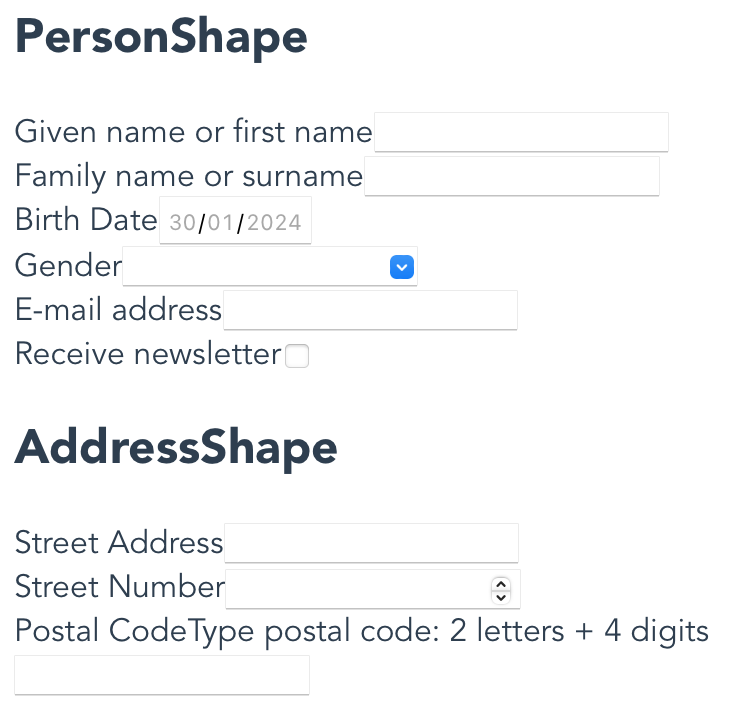
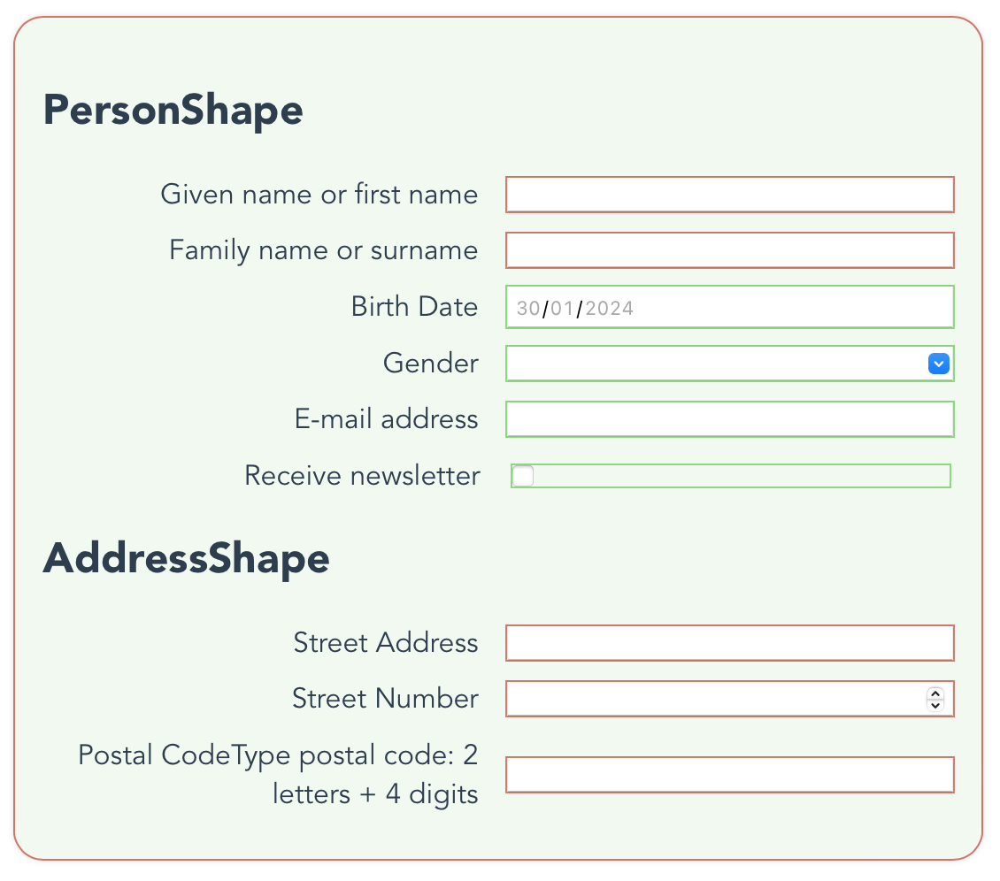
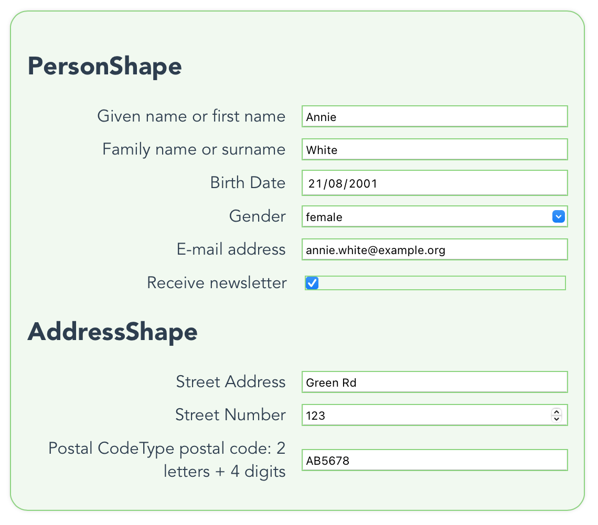
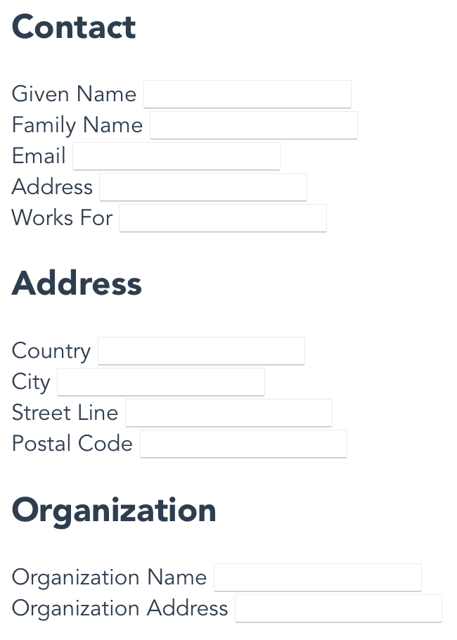
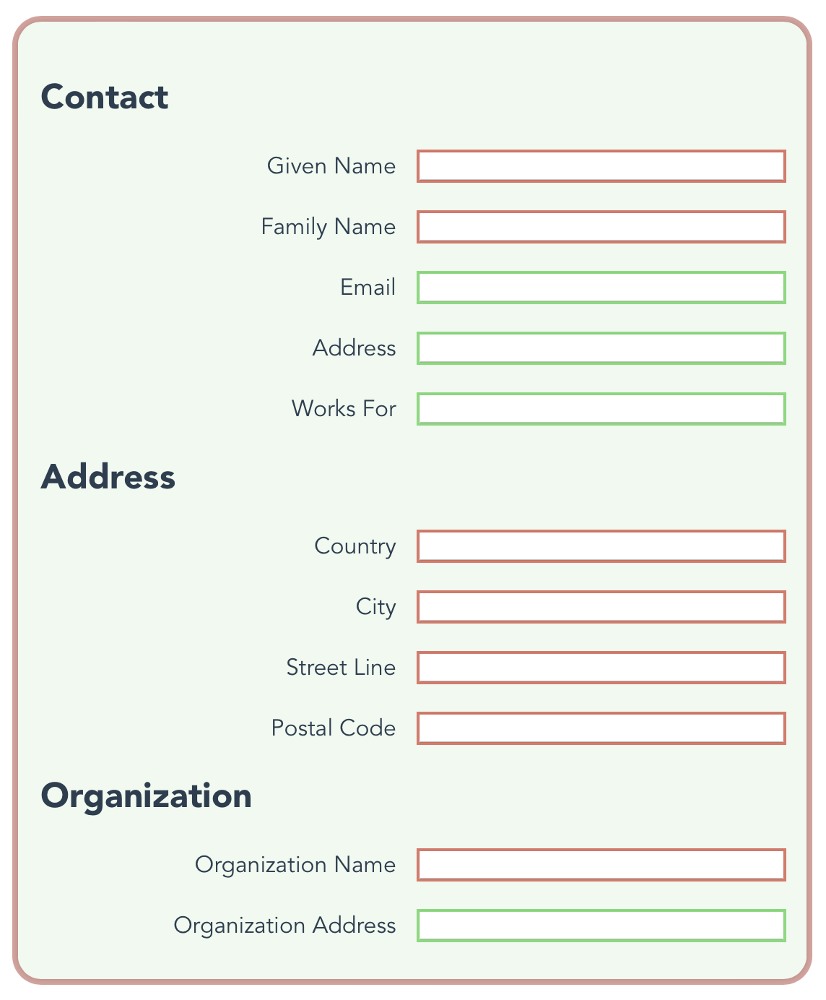
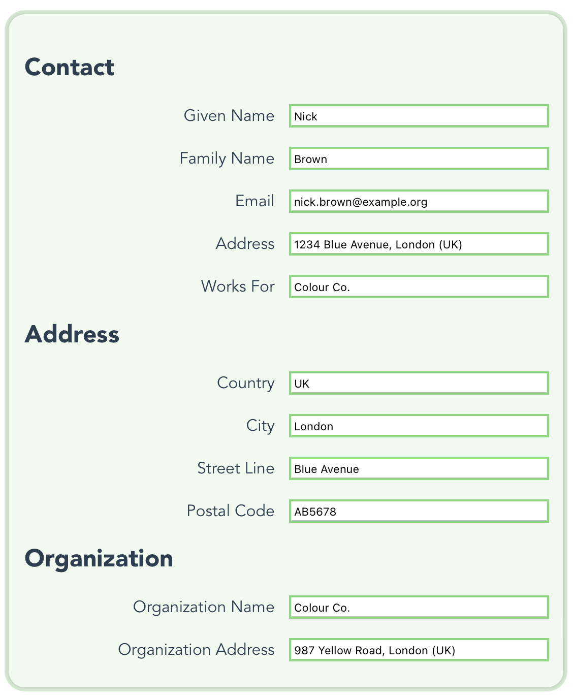

# Solid FE Form CLI

The Solid Front End Form CLI is meant to help creating forms on Vue/Angular frameworks from SHACL (Shapes Constraint Language) files.

## Index

- [Main Features](#mainfeatures)
- [Install](#install)
- [Usage and examples](#usage)
  - [List shapes available](#usage-list-shapes)
  - [Set custom CSS styles](#usage-set-custom-styles)
  - [Create form file and dependencies](#usage-create)
- [Uninstall](#uninstall)

## Main Features <a name="mainfeatures"></a>

- ```sfef list-shapes``` :     List of available shapes (SHACL .ttl files)

- ```sfef set-custom-css``` :   Set up custom CSS classes to be used in the form component

- ```sfef create``` :          Creates form component following SHACL shape

## Install <a name="install"></a>

- Solid-sfef-cli is a development CLI tool, it is recommened to install it using ```--global``` option.

    ```bash
    npm install @solidlab/solid-fef-cli --global
    ```

    or

    ```bash
    npm i @solidlab/solid-fef-cli -g
    ```

- It could also be install locally as a dev dependency using ```--save-dev``` option.

    ```bash
    npm install @solidlab/solid-fef-cli --save-dev
    ```

    or

    ```bash
    npm i @solidlab/solid-fef-cli -D
    ```

## Usage and examples<a name="usage"></a>

Print out the commands and options in the CLI tool

```bash
sfef help
```

### List shapes available <a name="usage-list-shapes"></a>

List the actual available shapes inside the solid-fef-cli package.

e.g. shapes inside the ```'/Users/myname/node_modules/@solidlab/solid-fef-cli/.assets/shacl/'``` path.

```bash
sfef list-shapes
```

### Set custom CSS styles <a name="usage-set-custom-styles"></a>

Define some custom CSS classes to be used when creating the form.

```bash
sfef set-custom-css
```

The command asks for CSS classes on:

- ```<form>``` element
- ```<div>``` wrapper around input and label
- ```<label>``` element
- ```<em>``` element which contains additional information binded to the label (```sh:description```)
- ```<input>``` element

The custom classes are stored in project root under filename **form-custom-classes.json**.

Example of custom CSS classes json structure:

```json
[
    {
        "element":"form",
        "classes":["css-custom__form"]
    }, {
        "element":"input-wrapper",
        "classes":["css-custom__wrapper"]
    }, {
        "element":"input-label",
        "classes":["css-custom__label", "css-custom__label--bold"]
    }, {
        "element":"input-additional-info",
        "classes":["css-custom__info"]
    }, {
        "element":"input-element",
        "classes":["css-custom__input", "css-custom__input--required"]
    }
]
```

### Create form file and dependencies <a name="usage-create"></a>

Creates the form component according to frame selected (vue/angular) and the shape (.ttl file).

```bash
sfef create --framework [vue/angular] --shape [fileName]
```

or

```bash
sfef create -f [vue/angular] -s [fileName]
```

With the optional parameter ```--css```, the component file will include the css classes available in **form-custom-classes.json**

```bash
sfef create --framework [vue/angular] --shape [fileName] --css
```

or

```bash
sfef create -f [vue/angular] -s [fileName] --c
```

The fileName could be a absolute path or a relative path in the solid-fef-cli package.

examples of valid **fileName** values:

- ```adresregister-SHACL```

    relative path expected to be in cli package. Check available .ttl file names using ```sfef list-shapes``` command.

- ```/Users/myname/Documents/GIT/myProject/.shapes/my-project-shape.ttl```

    absolute path

#### Vue example

```bash
sfef create -f vue -s example
```

Executing above command will create the ```FormExample.vue``` file in ```src/vue``` folder along with all depency components (```BasicInput.vue``` and ```BasicOption.vue```).

The ```example.ttl``` includes various input types: ```text```, ```date```, ```email```, ```checkbox``` and ```number```.

Being ```'Given name'```, ```'Family name'```, ```'Street address'```, ```'house number'``` and ```'Postal code'``` required fields.

The ```'Genre'``` field uses a ```<datalist>``` to restrict the options allowed.

Finally ```'Postal code'``` uses a ```regex``` pattern.

```html
// FormExample.vue
<template>
<form id="example" class="">
    <h2>PersonShape</h2>
    <BasicInput
        inputType="text"
        inputId="given-name-0-0"
        inputName="given-name-0-0"
        inputForm="example"
        inputWrapperClass=""
        inputClass=""
        inputLabel="Given name or first name"
        inputLabelClass="input-label "
        :inputRequired="true"
    />
    <BasicInput
        inputType="text"
        inputId="family-name-0-1"
        inputName="family-name-0-1"
        inputForm="example"
        inputWrapperClass=""
        inputClass=""
        inputLabel="Family name or surname"
        inputLabelClass="input-label "
        :inputRequired="true"
    />
    <BasicInput
        inputType="date"
        inputId="birth-date-0-2"
        inputName="birth-date-0-2"
        inputForm="example"
        inputWrapperClass=""
        inputClass=""
        inputLabel="Birth Date"
        inputLabelClass="input-label "
    />
    <BasicInput
        inputType="text"
        inputId="gender-0-3"
        inputName="gender-0-3"
        inputForm="example"
        inputWrapperClass=""
        inputClass=""
        inputLabel="Gender"
        inputLabelClass="input-label "
        inputListId="list-gender-0-3"
        :inputListOptions='[{"label":"Female","value":"female"},{"label":"Male","value":"male"}]'
    />
    <BasicInput
        inputType="email"
        inputId="email-0-4"
        inputName="email-0-4"
        inputForm="example"
        inputWrapperClass=""
        inputClass=""
        inputLabel="E-mail address"
        inputLabelClass="input-label "
    />
    <BasicInput
        inputType="checkbox"
        inputId="receive-newsletter-0-5"
        inputName="receive-newsletter-0-5"
        inputForm="example"
        inputWrapperClass=""
        inputClass=""
        inputLabel="Receive newsletter"
        inputLabelClass="input-label "
    />
    <BasicInput
        inputType="text"
        inputId="address-0-6"
        inputName="address-0-6"
        inputForm="example"
        inputWrapperClass=""
        inputClass=""
        inputLabel="Address"
        inputLabelClass="input-label "
    />
    <h2>AddressShape</h2>
    <BasicInput
        inputType="text"
        inputId="street-address-1-0"
        inputName="street-address-1-0"
        inputForm="example"
        inputWrapperClass=""
        inputClass=""
        inputLabel="Street Address"
        inputLabelClass="input-label "
        :inputRequired="true"
    />
    <BasicInput
        inputType="number"
        inputId="street-number-1-1"
        inputName="street-number-1-1"
        inputForm="example"
        inputWrapperClass=""
        inputClass=""
        inputLabel="Street Number"
        inputLabelClass="input-label "
        :inputRequired="true"
    />
    <BasicInput
        inputType="text"
        inputId="postal-code-1-2"
        inputName="postal-code-1-2"
        inputForm="example"
        inputWrapperClass=""
        inputClass=""
        inputLabel="Postal Code"
        inputLabelClass="input-label "
        inputAdditionalInfo="Type postal code: 2 letters + 4 digits"
        inputLabelInfoClass=""
        :inputRequired="true"
        inputPattern="[a-z A-Z]{2}[0-9]{4}"
    />
</form>
</template>
<script lang="ts">
import { defineComponent } from "vue"

import BasicInput from "./components/BasicInput.vue"
export default defineComponent({
    name: "FormExample",
    components: {
        BasicInput,
    },
})
</script>
```

Which will look like:



and with a some minimal styling:



when all fields are filled properly:



#### Angular example

```bash
sfef create -f angular -s another-example -c
```

Executing above command will create the ```FormAnotherExample.component.html``` and ```FormAnotherExample.component.ts``` file in ```src/app/FormAnotherExample``` folder along with ```BasicInput``` depency component.

The ```another-example.ttl``` includes various input types ```text``` and ```email```.

Being ```'Given name'```, ```'Family name'```, ```'Country'```, ```'City'```, ```'Street Line'```, ```'Postal code'``` and ```'Organization name'``` required fields.

As the optional ```-c``` (```--css```) is also present, the css classes from ```form-custom-classes.json``` are also applied.

```json
[
    {"element":"form","classes":["css__form"]},
    {"element":"input-wrapper","classes":["css__wrapper"]},
    {"element":"input-label","classes":["css__label"]},
    {"element":"input-additional-info","classes":["css__xtra-info"]},
    {"element":"input-element","classes":["css__input"]}
]
```

Resulting in following ```html``` and ```ts``` files:

```html
// FormAnotherExample.component.html
<form id="another-example" class="css__form">
    <h2>Contact</h2>
    <app-basic-input
        inputType="text"
        inputId="given-name-0-0"
        inputName="given-name-0-0"
        inputForm="another-example"
        inputWrapperClass="css__wrapper"
        inputClass="css__input"
        inputLabel="Given Name"
        inputLabelClass="input-label css__label"
        inputRequired="true"
    ></app-basic-input>
    <app-basic-input
        inputType="text"
        inputId="family-name-0-1"
        inputName="family-name-0-1"
        inputForm="another-example"
        inputWrapperClass="css__wrapper"
        inputClass="css__input"
        inputLabel="Family Name"
        inputLabelClass="input-label css__label"
        inputRequired="true"
    ></app-basic-input>
    <app-basic-input
        inputType="email"
        inputId="email-0-2"
        inputName="email-0-2"
        inputForm="another-example"
        inputWrapperClass="css__wrapper"
        inputClass="css__input"
        inputLabel="Email"
        inputLabelClass="input-label css__label"
    ></app-basic-input>
    <app-basic-input
        inputType="text"
        inputId="address-0-3"
        inputName="address-0-3"
        inputForm="another-example"
        inputWrapperClass="css__wrapper"
        inputClass="css__input"
        inputLabel="Address"
        inputLabelClass="input-label css__label"
    ></app-basic-input>
    <app-basic-input
        inputType="text"
        inputId="works-for-0-4"
        inputName="works-for-0-4"
        inputForm="another-example"
        inputWrapperClass="css__wrapper"
        inputClass="css__input"
        inputLabel="Works For"
        inputLabelClass="input-label css__label"
    ></app-basic-input>
    <h2>Address</h2>
    <app-basic-input
        inputType="text"
        inputId="address-country-1-0"
        inputName="address-country-1-0"
        inputForm="another-example"
        inputWrapperClass="css__wrapper"
        inputClass="css__input"
        inputLabel="Country"
        inputLabelClass="input-label css__label"
        inputRequired="true"
    ></app-basic-input>
    <app-basic-input
        inputType="text"
        inputId="address-locality-1-1"
        inputName="address-locality-1-1"
        inputForm="another-example"
        inputWrapperClass="css__wrapper"
        inputClass="css__input"
        inputLabel="City"
        inputLabelClass="input-label css__label"
        inputRequired="true"
    ></app-basic-input>
    <app-basic-input
        inputType="text"
        inputId="street-address-1-2"
        inputName="street-address-1-2"
        inputForm="another-example"
        inputWrapperClass="css__wrapper"
        inputClass="css__input"
        inputLabel="Street Line"
        inputLabelClass="input-label css__label"
        inputRequired="true"
    ></app-basic-input>
    <app-basic-input
        inputType="text"
        inputId="postal-code-1-3"
        inputName="postal-code-1-3"
        inputForm="another-example"
        inputWrapperClass="css__wrapper"
        inputClass="css__input"
        inputLabel="Postal Code"
        inputLabelClass="input-label css__label"
        inputRequired="true"
    ></app-basic-input>
    <h2>Organization</h2>
    <app-basic-input
        inputType="text"
        inputId="name-2-0"
        inputName="name-2-0"
        inputForm="another-example"
        inputWrapperClass="css__wrapper"
        inputClass="css__input"
        inputLabel="Organization Name"
        inputLabelClass="input-label css__label"
        inputRequired="true"
    ></app-basic-input>
    <app-basic-input
        inputType="text"
        inputId="address-2-1"
        inputName="address-2-1"
        inputForm="another-example"
        inputWrapperClass="css__wrapper"
        inputClass="css__input"
        inputLabel="Organization Address"
        inputLabelClass="input-label css__label"
    ></app-basic-input>
</form>
```

and

```ts
// FormAnotherExample.component.ts
import { Component, ViewEncapsulation } from '@angular/core';

import { BasicInputComponent } from "../components/BasicInput/BasicInput.component"

@Component({
    selector: "app-form-another-example",
    standalone: true,
    imports: [
        BasicInputComponent,
    ],
    templateUrl: './FormAnotherExample.component.html',
    encapsulation: ViewEncapsulation.None
})
export class FormAnotherExample {
}

```

Which will look like:



and with a some minimal styling:



when all fields are filled properly:



## Uninstall <a name="uninstall"></a>

To uninstall, simply run:

- for global installation:

    ```bash
    npm uninstall @solidlab/solid-fef-cli --global
    ```

    or

    ```bash
    npm rm @solidlab/solid-fef-cli -g
    ```

- for development installation:

    ```bash
    npm uninstall @solidlab/solid-fef-cli --save-dev
    ```

    or

    ```bash
    npm rm @solidlab/solid-fef-cli -D
    ```
